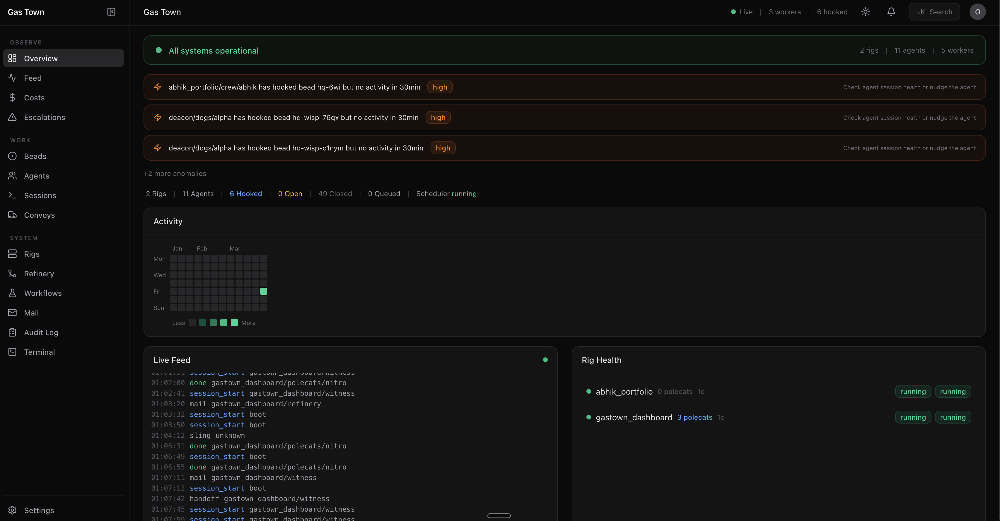
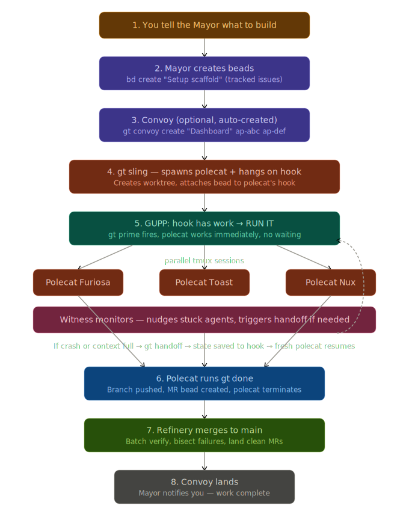
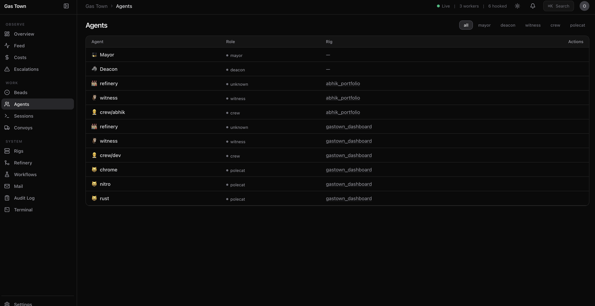
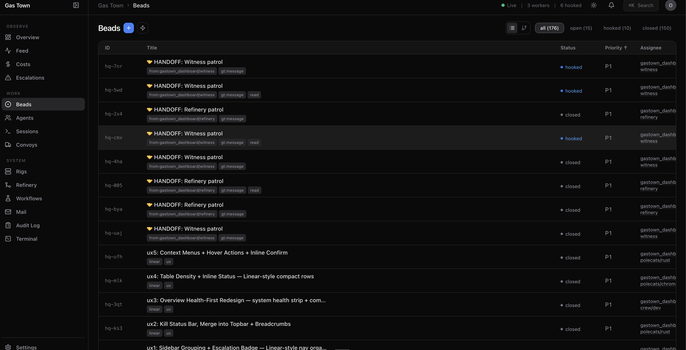

# Gas Town Dashboard

A real-time monitoring and control panel for [Gas Town](https://github.com/anthropics/gas-town) --- the multi-agent AI orchestration system. Think Vercel's dashboard meets Linear's information density, purpose-built for managing fleets of AI agents.



## How Gas Town Works

<p align="center">
  
</p>

## What is this?

Gas Town orchestrates dozens of AI agents (polecats, witnesses, refineries, deacons) across multiple rigs, each working on beads (issues) through molecules (workflows). This dashboard gives you full visibility and control over the entire system from a single browser tab.

**Built in a single session** by the Gas Town Mayor agent coordinating 3 parallel workers (1 crew member + 2 polecats), executing 33 beads across 9 phases. 103 commits. Zero manual code written.

## Features

### Observability --- See Everything

| Page | What it shows |
|------|--------------|
| **Overview** | System health strip, live event feed, rig health, scheduler status |
| **Agents** | All agents with role, rig, session status, hook info, activity timeline |
| **Sessions** | tmux session health across all rigs, running/stopped indicators |
| **Beads** | Full issue tracker with sort, filter, detail panel, inline status |
| **Rigs** | Rig cards with nested detail views showing agents, polecats, beads |
| **Convoys** | Work batch tracking with progress bars and bead breakdowns |
| **Refinery** | Per-rig merge queues with MR status |
| **Escalations** | Severity-sorted alerts with acknowledge/resolve actions |
| **Feed** | Full-page searchable event stream with type/actor filters |
| **Costs** | Token usage per agent, burn rate charts, per-rig cost breakdown |





### Control --- Act on Everything

| Feature | What it does |
|---------|-------------|
| **Sling work** | Assign beads to rigs/agents directly from the UI |
| **Create beads** | New bead form with title, description, priority, labels |
| **Close beads** | Mark work done with reason from the detail panel |
| **Nudge agents** | Wake idle agents with one click |
| **Start/Stop witnesses** | Control rig monitoring from the rig detail page |
| **Restart sessions** | Recover stuck agent sessions |
| **Pause/Resume scheduler** | Control the dispatch system |
| **Compose mail** | Send messages between agents |
| **Ack/Resolve escalations** | Triage alerts with inline confirmation |


### Intelligence --- Understand Everything

| Feature | What it shows |
|---------|--------------|
| **Sparklines** | Trend lines on stat cards showing activity over time |
| **Activity heatmap** | GitHub-contribution-style grid of agent activity |
| **Performance metrics** | Agent completion rates, throughput, efficiency |
| **Anomaly detection** | Auto-detected stuck agents, high error rates, zombie sessions |
| **Cost tracking** | Token burn rate, per-agent cost, cumulative spend |
| **Audit log** | Full history of every action taken through the dashboard |


### Power User Features

- **Cmd+K command palette** --- search agents, beads, rigs; navigate anywhere; trigger actions
- **Keyboard shortcuts** --- vim-style j/k navigation, g+o/a/b/r go-to combos, ? for help overlay
- **Right-click context menus** --- contextual actions on any table row
- **Hover-reveal actions** --- nudge icons appear on agent row hover
- **Inline confirmation** --- destructive actions require two clicks, auto-revert after 3s
- **Browser notifications** --- push alerts for critical escalations
- **Embedded terminal** --- run gt commands directly from the dashboard
- **Export data** --- download any table as CSV or JSON
- **SSE real-time updates** --- live data across all pages, no polling
- **Light/dark mode** --- toggle with localStorage persistence
- **Responsive layout** --- works on laptop, wide monitor, and tablet
- **Page transitions** --- smooth framer-motion fades between routes


## Architecture

```
gastown-dashboard/
├── packages/
│   ├── server/          # Express 5 backend (port 4800)
│   │   └── src/
│   │       ├── cli.ts           # Shell out to gt/bd with caching
│   │       ├── feed.ts          # SSE from .events.jsonl
│   │       ├── terminal.ts      # WebSocket shell for embedded terminal
│   │       ├── audit.ts         # Action logging middleware
│   │       └── routes/          # 18 REST API route files
│   └── web/             # React 18 + Vite (port 5173)
│       └── src/
│           ├── pages/           # 17 page components
│           ├── components/      # 18 shared components
│           ├── hooks/           # useFetch, useSSE, useKeyboard, useToast...
│           └── lib/             # types, api client, utils
├── turbo.json           # Turborepo for dev/build
└── pnpm-workspace.yaml  # pnpm monorepo
```

### Data Flow

```
gt/bd CLI commands
       │
       ▼
Express backend ──── shell out ──── gt rig list --json
  (port 4800)                       bd list --json
       │                            gt agents list --all
       ├── REST API (18 routes)     gt session list --json
       ├── SSE (tail .events.jsonl) gt mail inbox --json
       └── WebSocket (terminal)     gt escalate list --json
       │
       ▼
React frontend ──── fetch/SSE ──── useFetch (polling)
  (port 5173)                      useSSE (real-time)
                                   useRealtime (hybrid)
```

### Tech Stack

| Layer | Technology |
|-------|-----------|
| Frontend | React 18, TypeScript, Vite 6 |
| Styling | Tailwind CSS v4, shadcn/ui (new-york) |
| Charts | Recharts, d3 |
| Icons | Lucide React |
| Routing | React Router v7 |
| Animations | Framer Motion |
| Terminal | xterm.js + WebSocket |
| Backend | Express 5, tsx |
| Data | gt/bd CLI (shell out + cache) |
| Build | pnpm workspaces, Turborepo |

## Quick Start

```bash
# Prerequisites: Node.js 22+, pnpm, Gas Town running (gt/bd on PATH)

git clone https://github.com/abhiksark/gastown-dashboard.git
cd gastown-dashboard
pnpm install
pnpm dev

# Open http://localhost:5173
```

One command. Server starts on 4800, frontend on 5173. Vite proxies `/api/*` to the backend.

## How it was built

This entire dashboard was built by Gas Town itself --- the Mayor agent designed the architecture, wrote implementation plans, and dispatched work to crew members and polecats running in parallel.

### Build timeline

| Phase | What | Beads | Workers |
|-------|------|-------|---------|
| v1 | Core pages (Overview, Agents, Beads, Rigs) + backend + SSE | 12 tasks | 1 crew |
| v2 | Convoys, Refinery, Escalations | 11 tasks | 1 crew |
| v3 | Mail page with inbox, compose, archive | 8 tasks | 1 crew |
| v4 | Navigation (Cmd+K, clickable entities, detail panels, toasts) + Molecules + Workflows | 9 tasks | 1 crew |
| p5 | Sessions, Activity Timeline, Feed Search, Sparklines | 5 beads | 1 crew + 2 polecats |
| p6 | Sling/Create from UI, Agent Control, Settings, Convoy Management | 4 beads | 1 crew + 2 polecats |
| p7 | SSE Real-Time, Responsive, Light Mode | 2 beads | polecats |
| p8 | Cost Tracking, Performance Metrics, Anomaly Detection, Heatmap | 5 beads | 1 crew + 2 polecats |
| p9 | Keyboard Shortcuts, Browser Notifications, Terminal, Export, Audit Log | 5 beads | 1 crew + 2 polecats |
| UX | Linear-style sidebar grouping, health strip, table density, context menus, breadcrumbs | 5 beads | 1 crew + 2 polecats |

### The meta moment

The dashboard you're looking at was built by the same system it monitors. The Mayor dispatched beads, polecats executed them, the witness monitored health, and the refinery processed merges --- all visible in this very dashboard.

## Adding Screenshots

To add screenshots, take browser captures and save them to `docs/screenshots/`:

```bash
mkdir -p docs/screenshots
# Take screenshots of each page and save as:
# overview.png, agents.png, beads.png, rig-detail.png,
# workflows.png, command-palette.png, feed.png, etc.
```

## License

MIT
