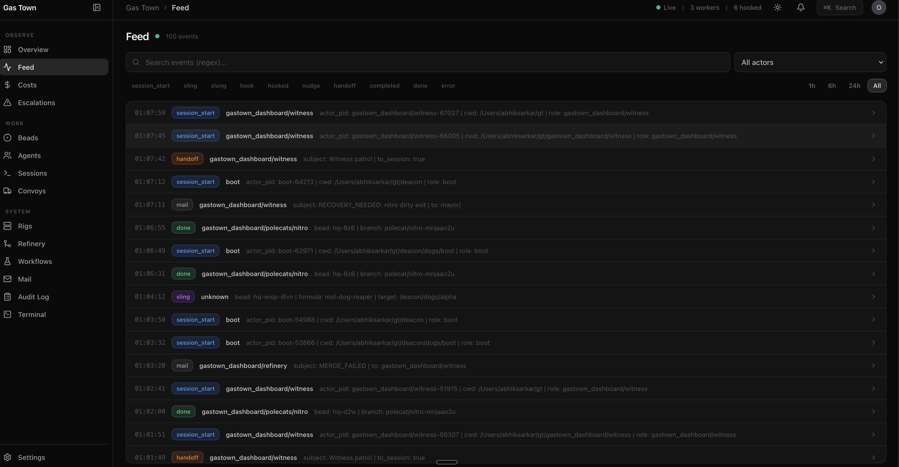
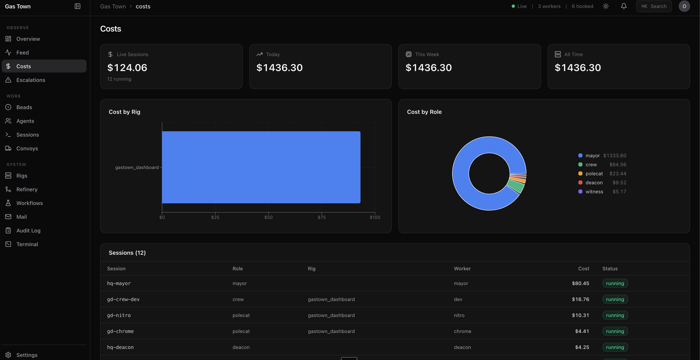

<p align="center">
  <h1 align="center">Gas Town Dashboard</h1>
  <p align="center">
    Real-time monitoring and control panel for <a href="https://github.com/steveyegge/gastown">Gas Town</a> multi-agent orchestration
  </p>
</p>

<p align="center">
  <a href="#quick-start"></a>
  <a href="#features"></a>
  <a href="#architecture"></a>
  <a href="#how-it-was-built"></a>
</p>

<p align="center">
  
  
  
  
  
  
  
</p>

<br />

<p align="center">
  
</p>

---

## What is Gas Town Dashboard?

Gas Town orchestrates fleets of AI agents --- polecats, witnesses, refineries, deacons --- across multiple rigs, each working on beads (issues) through molecules (workflows). **This dashboard gives you full visibility and control from a single browser tab.**

Think **Vercel's deployment dashboard** meets **Linear's issue tracker**, purpose-built for multi-agent AI systems.

> **Meta:** This entire dashboard was built by Gas Town itself --- the Mayor agent coordinated 3 parallel workers across 33 beads and 9 phases. 103 commits. Zero manual code.

<br />

## How Gas Town Works

<p align="center">
  
</p>

<br />

## Quick Start

```bash
# Prerequisites: Node.js 22+, pnpm, Gas Town running (gt/bd on PATH)

git clone https://github.com/abhiksark/gastown-dashboard.git
cd gastown-dashboard
pnpm install
pnpm dev
```

Opens at **http://localhost:5173**. Server on 4800, frontend on 5173, Vite proxies `/api/*` automatically.

<br />

## Features

### Observe --- See Everything at a Glance

The **Overview** page is your mission control. A single green/amber/red health strip tells you if the system needs attention. Anomaly detection surfaces stuck agents automatically. The activity heatmap shows work patterns over time. The live feed streams every event via SSE.

<p align="center">
  
</p>

<br />

### Track --- Every Agent, Every Bead, Every Session

The **Agents** page shows all workers across all rigs with role badges, session status, and one-click nudge. Click any agent for a detail panel with activity timeline and hook status.

<p align="center">
  
</p>

The **Beads** page is a full issue tracker --- sort by priority, filter by status, click for detail panel with full description. Left-border color coding shows status at a glance. Filter tabs show live counts.

<p align="center">
  
</p>

<br />

### Investigate --- Search, Filter, Drill Down

The **Feed** page gives you a searchable, filterable view of every event in the system. Filter by event type, actor, or search with regex. Click to expand any event and see the full JSON payload.

<p align="center">
  
</p>

<br />

### Analyze --- Costs, Performance, Anomalies

The **Costs** page tracks token usage per agent and per rig. See burn rates, cumulative spend, and cost distribution across your fleet. The performance metrics page shows completion rates and throughput.

<p align="center">
  
</p>

<br />

### Control --- Act on Everything

| Action | What it does |
|--------|-------------|
| **Sling work** | Assign beads to rigs/agents from the UI |
| **Create beads** | New bead form with title, description, priority, labels |
| **Close beads** | Mark done with reason from the detail panel |
| **Nudge agents** | Wake idle workers with one click |
| **Start/Stop witnesses** | Control rig monitoring |
| **Restart sessions** | Recover stuck agents |
| **Pause/Resume scheduler** | Control the dispatch system |
| **Compose mail** | Send messages between agents |
| **Ack/Resolve escalations** | Triage alerts with inline confirmation |

<br />

### Power User Features

| Feature | How |
|---------|-----|
| **Cmd+K palette** | Search agents, beads, rigs. Navigate anywhere. Trigger actions. |
| **Keyboard shortcuts** | Vim-style j/k navigation, g+o/a/b/r go-to combos, ? for help |
| **Right-click menus** | Contextual actions on any table row |
| **Hover actions** | Nudge icon appears on agent row hover |
| **Inline confirm** | Destructive actions require two clicks, auto-revert after 3s |
| **Browser notifications** | Push alerts for critical escalations |
| **Embedded terminal** | Run gt commands directly from the dashboard |
| **Export data** | Download any table as CSV or JSON |
| **SSE real-time** | Live data across all pages via Server-Sent Events |
| **Light/dark mode** | Toggle with localStorage persistence |
| **Responsive** | Works on laptop, wide monitor, and tablet |
| **Page transitions** | Smooth framer-motion fades between routes |

<br />

## All Pages

| Page | Description |
|------|------------|
| **Overview** | Health strip, anomaly alerts, activity heatmap, live feed, rig health, scheduler |
| **Feed** | Full-page searchable event stream with type/actor filters |
| **Costs** | Token usage charts, burn rate, per-rig and per-role cost breakdown |
| **Escalations** | Severity-sorted alerts with ack/resolve actions |
| **Beads** | Issue tracker with sort, filter, detail panel, inline status |
| **Agents** | Agent table with role badges, session status, activity timeline |
| **Sessions** | tmux session health, running/stopped indicators per rig |
| **Convoys** | Work batch progress bars with bead breakdowns |
| **Rigs** | Rig cards with nested detail views (agents, polecats, beads) |
| **Refinery** | Per-rig merge queues with MR status |
| **Workflows** | Formula library + active molecule step tracker |
| **Mail** | Split-pane inbox, message detail, compose dialog |
| **Settings** | Scheduler controls, agent presets, rig configuration |
| **Audit Log** | History of every action taken through the dashboard |
| **Terminal** | Embedded shell for running gt/bd commands |
| **Agent Detail** | Per-agent activity timeline with SSE event streaming |
| **Rig Detail** | Rig topology with agents, polecats, beads, control buttons |

<br />

## Architecture

```
gastown-dashboard/
├── packages/
│   ├── server/                 # Express 5 backend (port 4800)
│   │   └── src/
│   │       ├── cli.ts          # Shell out to gt/bd with 7s TTL cache
│   │       ├── feed.ts         # SSE from .events.jsonl via fs.watch
│   │       ├── terminal.ts     # WebSocket shell for embedded terminal
│   │       ├── audit.ts        # Action logging middleware
│   │       └── routes/         # 18 REST API route files
│   └── web/                    # React 18 + Vite 6 frontend (port 5173)
│       └── src/
│           ├── pages/          # 17 page components
│           ├── components/     # 18 shared components + shadcn/ui
│           ├── hooks/          # useFetch, useSSE, useRealtime, useKeyboard...
│           └── lib/            # TypeScript types, API client, utilities
├── bin/                        # CLI entry point (gastown-dashboard start)
├── turbo.json                  # Turborepo task pipeline
└── pnpm-workspace.yaml         # pnpm monorepo
```

### Data Flow

The backend is a thin wrapper around `gt` and `bd` CLI commands. No database --- all state lives in Gas Town's `.beads/` directory and `.events.jsonl` file.

```
┌─────────────────┐     shell out      ┌──────────────────────┐
│  Express Server  │ ─────────────────► │  gt rig list --json  │
│   (port 4800)   │                    │  bd list --json      │
│                  │ ◄───────────────── │  gt agents list      │
│  ┌── REST (18)  │     JSON / text    │  gt session list     │
│  ├── SSE        │                    │  gt mail inbox       │
│  └── WebSocket  │                    │  gt escalate list    │
└────────┬────────┘                    └──────────────────────┘
         │
    fetch / SSE
         │
┌────────▼────────┐
│  React Frontend  │
│   (port 5173)   │
│                  │
│  useFetch ─── polling with cache
│  useSSE ───── real-time events
│  useRealtime ─ hybrid (SSE + fetch)
└─────────────────┘
```

### Tech Stack

| Layer | Technology |
|-------|-----------|
| **Frontend** | React 18, TypeScript, Vite 6 |
| **Styling** | Tailwind CSS v4, shadcn/ui (new-york style, zinc base) |
| **Charts** | Recharts, d3 |
| **Icons** | Lucide React |
| **Routing** | React Router v7 |
| **Animations** | Framer Motion |
| **Terminal** | xterm.js + WebSocket |
| **Backend** | Express 5, tsx (dev), Node.js 22 |
| **Data** | gt/bd CLI commands (shell out + in-memory cache) |
| **Real-time** | Server-Sent Events (tail .events.jsonl) |
| **Build** | pnpm workspaces, Turborepo |

<br />

## How It Was Built

This dashboard was built entirely by Gas Town agents. The **Mayor** (coordinator) designed the architecture, wrote implementation plans, and dispatched work to **crew members** and **polecats** (disposable workers) running in parallel.

### Build Timeline

| Phase | What was built | Tasks | Workers |
|-------|---------------|-------|---------|
| **v1** | Core dashboard: Overview, Agents, Beads, Rigs + Express backend + SSE feed | 12 | 1 crew |
| **v2** | Convoys, Refinery, Escalations pages | 11 | 1 crew |
| **v3** | Mail page with split-pane inbox, compose, archive | 8 | 1 crew |
| **v4** | Cmd+K palette, clickable entities, detail panels, toasts, Workflows | 9 | 1 crew |
| **Phase 5** | Sessions monitoring, Activity timeline, Feed search, Sparklines | 5 | 1 crew + 2 polecats |
| **Phase 6** | Sling/Create from UI, Agent/Rig control, Settings, Convoys mgmt | 4 | 1 crew + 2 polecats |
| **Phase 7** | SSE real-time updates, Responsive layout, Light mode | 2 | 2 polecats |
| **Phase 8** | Cost tracking, Performance metrics, Anomaly detection, Heatmap | 5 | 1 crew + 2 polecats |
| **Phase 9** | Keyboard shortcuts, Browser notifications, Terminal, Audit log | 5 | 1 crew + 2 polecats |
| **UX** | Linear-style sidebar, health strip, table density, context menus | 5 | 1 crew + 2 polecats |

### The Meta Moment

The dashboard you're looking at was **built by the same system it monitors**. The Mayor dispatched beads, polecats executed them, the witness monitored health, the refinery processed merges --- and every one of those actions is visible in this very dashboard's feed, bead tracker, and convoy progress bars.

<br />

## Development

```bash
# Start in development mode (hot reload)
pnpm dev

# Type check
cd packages/web && npx tsc --noEmit

# Build for production
pnpm build
```

### Project Stats

- **17 pages** | **18 backend routes** | **18 shared components**
- **103+ commits** | **33 beads executed** | **9 development phases**
- **3 parallel workers** at peak throughput
- **0 lines** of manually written code

<br />

## Contributing

Contributions welcome! This project follows the patterns established by Gas Town agents:

1. Fork the repository
2. Create a feature branch
3. Make your changes (follow existing Tailwind + shadcn/ui patterns)
4. Submit a pull request

<br />

## License

MIT

---

<p align="center">
  <sub>Built with Gas Town by AI agents, for AI agent operators.</sub>
</p>
